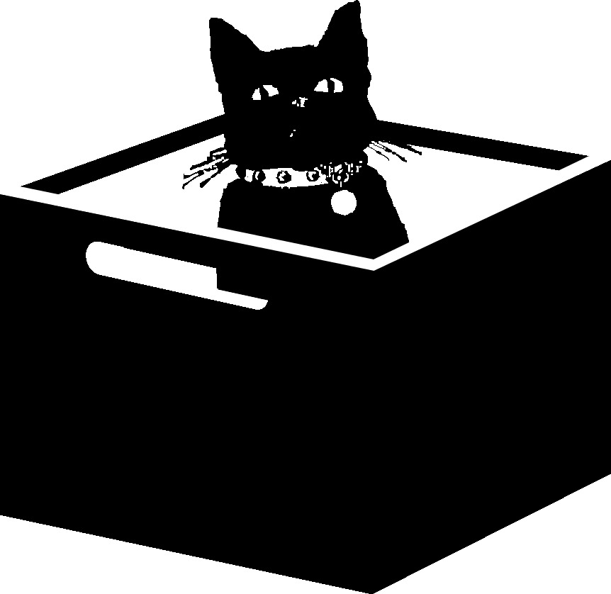

Crates is a database for your media allowing F2F curation and sharing of playlists.

**BASE CLASSES WILL BE PROVIDED**. For iterative modules, a generator interface
may be defined soon to support progress bars and time remaining indicators.

Logical Modules

1. **CAS**: Content addressable store for immutable data (MP3 files etc).
2. **index**: Database of file metadata metadata. Old files are deprecated.
   Deprecated files can be garbage collected if desired.
3. **Crawlers**: Systems that programatically curate files
4. **Mapper**: Part of (1) and (2) which organises files as symlinks on the
   filesystem. Other apps can then use the database.

# Crawlers
Crawlers are an automatic way of improving and extending your collection.

Implemented:
  * Filesystem (this includes itunes): Look for media on local computer
  * Soundcloud: Download best-effort quality starred items from any username.
    Songs could be deprecated in favor of purchased (better bitrate) songs at a
    later date.
  * PeerCrawler -- Download from another crates server via query or feed

Pending:
  * Add chromaprint/acoustid, BPM, Camelot key, MBID
  * Identify songs that have no metadata via acoustid API call (or correct
    existing)
  * Get some better album art via MBID and online database (MusicBrainz, IMDB)
  * iTunes vi pyitunes: better metadata might be available.

Crawlers may create a fully-packed MP3 file in a temporary location if
necessary. For example, raw soundcloud MP3s had little metadata. It is not
necessary for mutators to be used in conjunction with crawlers. Crawlers may
also crawl the crates database itself to generate new, improved files.

# Playlists ("crates")
One of the main features of crates is to be able to make/share playlists for
DJing. Each playlist has an ID and is shared with Peers.

Serato/Mixxx/Traktor import/export is planned.

# Installation
`sudo apt-get install libpython-dev python-pip`
`sudo pip install --upgrade -r requirements.txt`

Edit crates/settings.py

## Development

    # create database and superuser account
    ./manage.py syncdb
    # run local server in development mode
    ./manage.py runserver 0.0.0.0:8080
    # crawl
    ./manage.py crawl ~/Music

## Production
Guide pending, uses nginx+uwsgi+ansible. See `ansible/` for an incomplete example.

# Consumption
Map to a location:

	./manage.py map /exports/music

Then run a samba server with example conf. To get play counts and notifications
run hit counter daemon.
